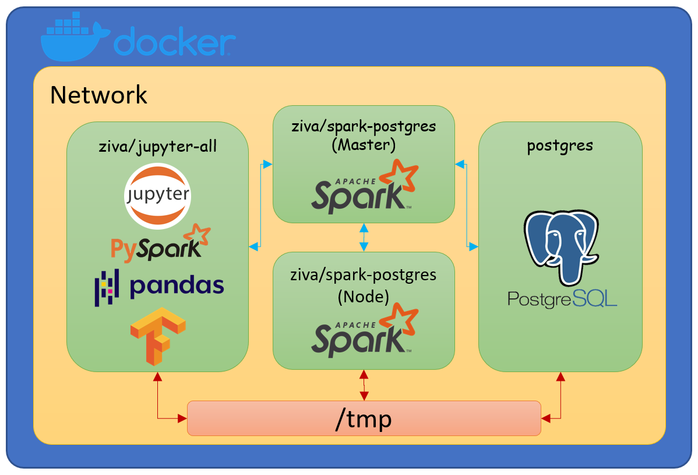
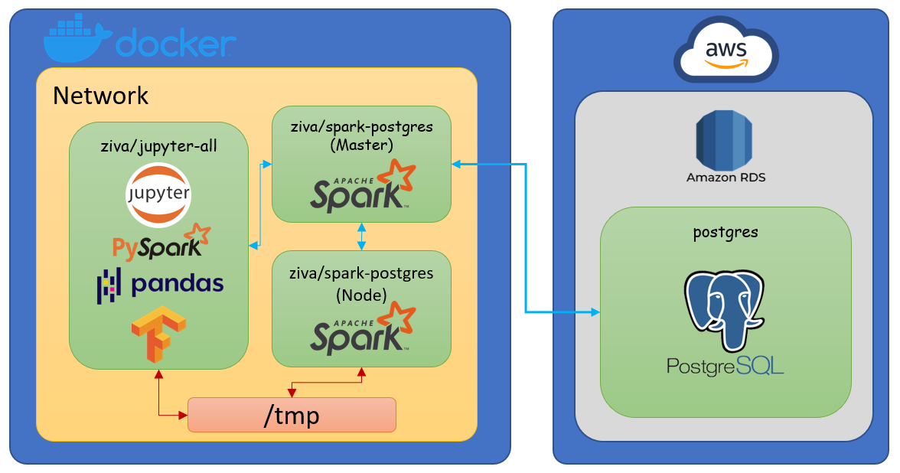
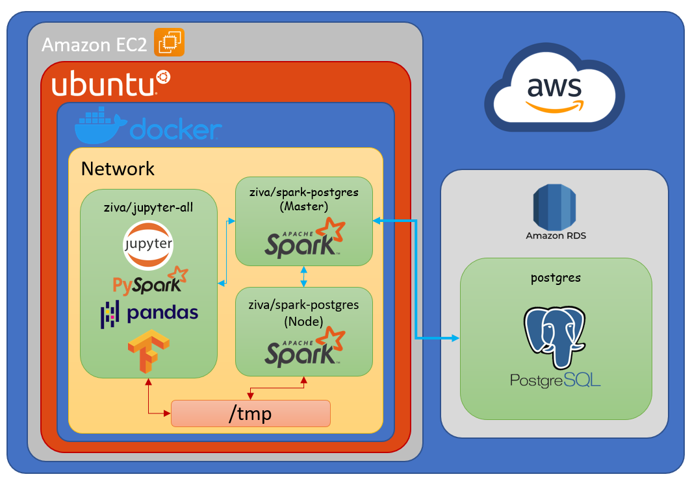

## Architecture





## Building the environment

```bash
git clone https://github.com/zivadanika/DE-Individual-Coursework.git
cd DE-Individual-Coursework
make all
```

## Testing with Jupyter

http://localhost:9999. Jupyter will then ask for a token for authentication. This token can easily be obtained using the following:

```bash
cd project
make jupyter_token
```

